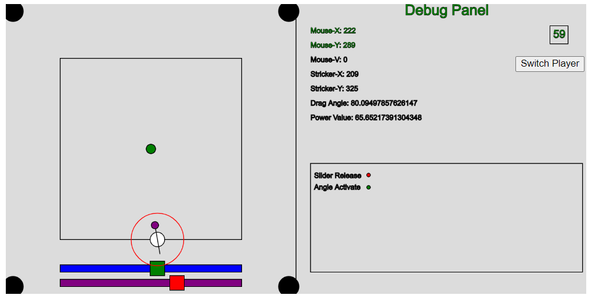

# Changelog

**Fixed bugs:**

- None
## [Unreleased]
**Log Date:**
## [24.03.2023] - YYYY-MM-DD
**New Updates:**

- Displaying boolean value changes
- Displaying framerate
- Additional debug information
- Power Slider to notify power
- Power rings with colors based on condition
- Border collitions
- Angle control using mouse
- Switching Players

**Existing Issues:**
- Switching players doesn't turn angle guidance
- No provison to move striker
- Addition of stroke reduced readability

**Image Update:**
